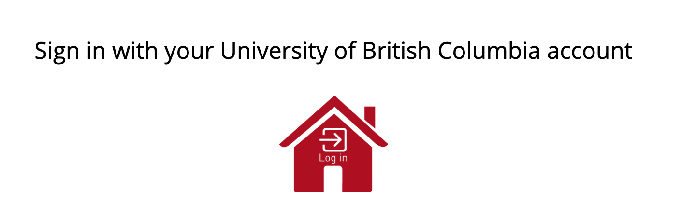
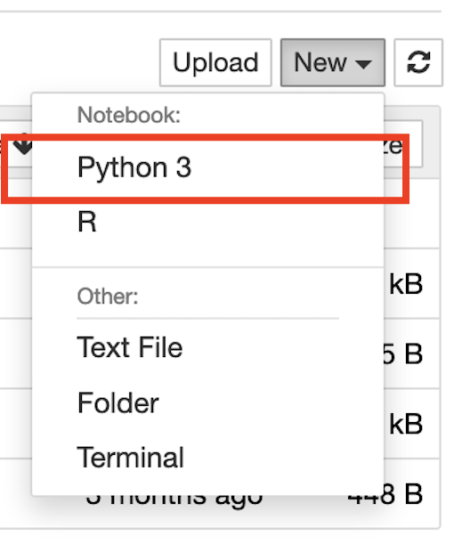

# Activities

## Data Miner Activity

If you haven't already, install <a href="https://chrome.google.com/webstore/detail/data-scraper-easy-web-scr/nndknepjnldbdbepjfgmncbggmopgden">Data Miner plugin for Chrome</a>.

1. Working from the "Recipes" tab, try the following:
* Go to Google Scholar, do a search, and save the results of your search with the "Google Scholar" Recipe.

2. Build a new recipe to get names and emails from the UBC directory.

## Python Activity

For this activity we will be working in [UBC Syzygy](https://ubc.syzygy.ca/). Syzygy is a collection of research tools that are accessible through a web browser. One of these tools is "Jupyter" which is an electronic notebook that lets you run scripts in common programming languages and see the output immediately with no additional installation or setup required.

1. Please log in to [UBC Syzygy here](https://ubc.syzygy.ca/). Click on the red house and log in via UBC CWL.

2. In the upper right hand side of the page select "New" and then "Python 3" from the dropdown.

3. From this point, we will be following the tutorial here: <a href="https://docs.python-guide.org/scenarios/scrape/">"Hitchhikers Guide to Python" html scraping</a>.
