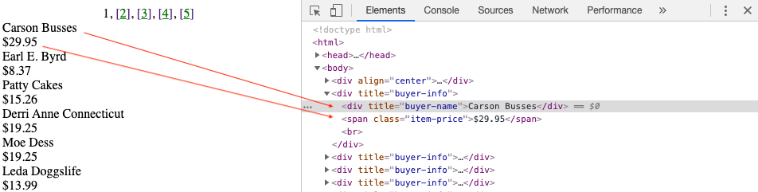

# Tools and approaches

<em><a href="../slides/tools-and-approaches.html" target="_blank">View slides</a> for this section</em>

As we saw with Data Miner, modern visual scraping tools are robust, designed to avoid getting blocked by the requirements of a specific website, and generally easy to set up. Tools like Data Miner can truly accomplish basic web scraping tasks with a few simple clicks. But what if Data Miner ceases to exist? What if you want to create a workflow that others can use no matter what tool they are using? Working with web scraping in a research context requires a level of reproducibility which may not be easy to achieve with proprietary tools (including Data Miner).

In this workshop we focus on visual web scraping with Data Miner to familiarize you with the structure of a website and how to target different areas with a scraping tool. Our focus is to build a mental model of web scraping generally. However, if you would like to have more control over what you are doing, be able to share a detailed explanation of how you got the data that you scraped, and share your process in a sustainable way, scripting is a better approach for you.

## A note about environment setup

This workshop is not intended to teach you how to program or to set up your computer to work with programming languages. For absolute beginners who are interested in exploring scripts without the overhead of environment setup, Project Jupyter is a great resource. Jupyter Notebooks are hosted computational environments that require minimal environment setup. You can see Jupyter in action and try a notebook here: [https://jupyter.org/try](https://jupyter.org/try). Select "Try Classic Notebook" for a basic Python environment.

## What are scripting tools for web scraping

Generally tools can be divided into two categories:
* Tools that get information from the web
* Tools that parse the information you getting

For the examples in this workshop we will be looking at a simple Python script. Python is a common programming language and has a number of tools inside of it that help with web scraping. It is also relatively friendly for beginners to understand. In Python sets of related tools get organised into "Libraries" (eg. tools for both scraping and parsing in one) and "Frameworks" which offer more structure for the application of a certain set of tools than a library would.

Below is an example of a simple Python script taken from the <a href="https://docs.python-guide.org/scenarios/scrape/">"Hitchhikers Guide to Python" html scraping tutorial</a>.

Input
{: .label .label-green }
~~~python
  from lxml import html
  import requests
  page = requests.get('http://econpy.pythonanywhere.com/ex/001.html')
  tree = html.fromstring(page.content)
  #This will create a list of buyers:
  buyers = tree.xpath('//div[@title="buyer-name"]/text()')
  #This will create a list of prices
  prices = tree.xpath('//span[@class="item-price"]/text()')
  print (buyers)
  print (prices)
~~~

Output
{: .label .label-yellow }
~~~python
['Carson Busses', 'Earl E. Byrd', 'Patty Cakes', 'Derri Anne Connecticut', 'Moe Dess', 'Leda Doggslife', 'Dan Druff', 'Al Fresco', 'Ido Hoe', 'Howie Kisses', 'Len Lease', 'Phil Meup', 'Ira Pent', 'Ben D. Rules', 'Ave Sectomy', 'Gary Shattire', 'Bobbi Soks', 'Sheila Takya', 'Rose Tattoo', 'Moe Tell']

['$29.95', '$8.37', '$15.26', '$19.25', '$19.25', '$13.99', '$31.57', '$8.49', '$14.47', '$15.86', '$11.11', '$15.98', '$16.27', '$7.50', '$50.85', '$14.26', '$5.68', '$15.00', '$114.07', '$10.09']
~~~

We can see the structure of the script reflected when we use the inspect function in a browser.

### Web Scraping with Python

The most common Python based tools for web scraping that you are likely to run into are:
* <a href="https://requests.readthedocs.io/en/master/">requests</a>
  * a library for getting data from the web.
  * tools to communicate over HTTP.
* <a href="https://docs.python.org/2/library/urllib.html">urllib</a>
  * tools to communicate over HTTP.
  * best for smaller amounts of data, very similar to requests.
* <a href="https://lxml.de/">lxml<a/>
  * a set of tools for parsing html and xml.
* <a href="https://www.crummy.com/software/BeautifulSoup/bs4/doc/">Beautiful Soup</a>
  * a slightly larger set of tools for parsing html and xml.
* <a href="https://scrapy.org/">Scrapy</a>
  * a framework for web crawling and web scraping. For getting small and large amounts of data from the web and automating requests to happen repeatedly or over time.
  * A parser which processes html or xml by standardizing it. Beautiful soup can troubleshoot structural problems in the output of your scrape such missing or open html tags.

### Web Scraping with R

[R](https://www.r-project.org/about.html) is a feature rich programming language designed for statistical computing and graphics.

The most common R based tool for web scraping is:

* [rvest](https://cran.r-project.org/web/packages/rvest/index.html)
  * rvest is not included in [tidyverse](https://www.tidyverse.org/) but it is related and works well with the collection of included packages.
