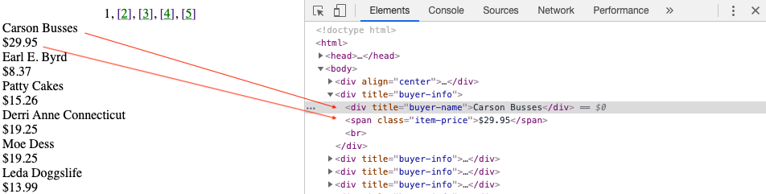

# Tools and approaches

## Working with a visual tools

There are many reasons that you might want to skip the scripting process and want to use a pre-built tool. Modern visual scraping tools are robust, designed to avoid getting blocked by the requirements of a specific website, and generally easy to set up.

For this workshop we will primarily be talking about one tool that represents a good example of a visual web scraper:

<a href="https://data-miner.io/">Dataminer</a>(and other plugins)

## Scripting

For this workshop we are focusing on Python based tools. Python is a common programming language and has a number of tools inside of it that help with web scraping. It is also relatively friendly for beginners to understand. There are many other tools for web scraping in other languages.

Generally tools can be divided into two general categories:
* Tools that get information from the web
* Tools that parse the information you getting

In Python sets of related tools get organized into "Libraries" (eg. tools for both scraping and parsing in one) and "Frameworks" which offer more structure for the application of a certain set of tools than a library would.

The most common Python based tools for web scraping that you are likely to run into are:
* <a href="https://requests.readthedocs.io/en/master/">requests</a>
  * a library for getting data from the web.
  * tools to communicate over HTTP.
* <a href="https://docs.python.org/2/library/urllib.html">urllib</a>
  * tools to communicate over HTTP.
  * best for smaller amounts of data, very similar to requests.
* <a href="https://lxml.de/">lxml<a/>
  * a set of tools for parsing html and xml.
* <a href="https://www.crummy.com/software/BeautifulSoup/bs4/doc/">Beautiful Soup</a>
  * a slightly larger set of tools for parsing html and xml.
* <a href="https://scrapy.org/">Scrapy</a>
  * a framework for web crawling and web scraping. For getting small and large amounts of data from the web and automating requests to happen repeatedly or over time.
  * A parser which processes html or xml by standardizing it. Beautiful soup can troubleshoot structural problems in the output of your scrape such missing or open html tags.

Below is an example of a simple Python script taken from the <a href="https://docs.python-guide.org/scenarios/scrape/">"Hitchhikers Guide to Python" html scraping tutorial</a>.

Input
{: .label .label-green }
~~~python
  from lxml import html
  import requests
  page = requests.get('http://econpy.pythonanywhere.com/ex/001.html')
  tree = html.fromstring(page.content)
  #This will create a list of buyers:
  buyers = tree.xpath('//div[@title="buyer-name"]/text()')
  #This will create a list of prices
  prices = tree.xpath('//span[@class="item-price"]/text()')
  print (buyers)
  print (prices)
~~~

Output
{: .label .label-yellow }
~~~python
['Carson Busses', 'Earl E. Byrd', 'Patty Cakes', 'Derri Anne Connecticut', 'Moe Dess', 'Leda Doggslife', 'Dan Druff', 'Al Fresco', 'Ido Hoe', 'Howie Kisses', 'Len Lease', 'Phil Meup', 'Ira Pent', 'Ben D. Rules', 'Ave Sectomy', 'Gary Shattire', 'Bobbi Soks', 'Sheila Takya', 'Rose Tattoo', 'Moe Tell']

['$29.95', '$8.37', '$15.26', '$19.25', '$19.25', '$13.99', '$31.57', '$8.49', '$14.47', '$15.86', '$11.11', '$15.98', '$16.27', '$7.50', '$50.85', '$14.26', '$5.68', '$15.00', '$114.07', '$10.09']
~~~

We can see the structure of the script reflected when we use the inspect function in a browser.

### Why use a script?

Tools such as Dataminer have the benefit of convenience and are certainly capable of answering challenging questions. However, in an academic context, it is important to have an understanding of exactly what is happening to produce a result. Moreover it is important to be able to communicate this to others and to share the entirety of your work with others down the line. As a proprietary tool, we don't really know how Dataminer is structured and aspects of it may change on us without warning. A colleage using a tool differently, in a different moment in time, or on a different system might also get a different output for reasons that are difficult to explain without understanding the nuances of how a tool works. Open source tools such as Python essentially "take out the middleman" and allow you to represent the reality of the steps you take to achieve a result and what variables are influencing it. It is also easier to share the entirety of your workflow as well as your output with others.
