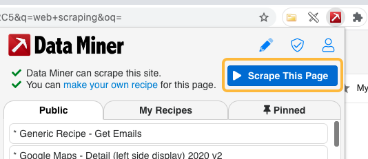
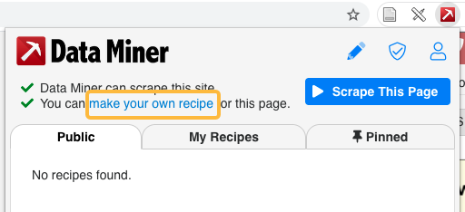
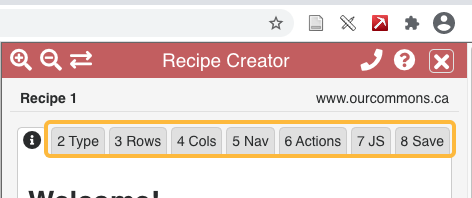
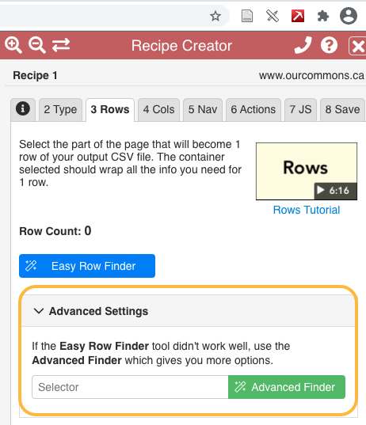

# Understanding website structure

<em><a href="../slides/website-structure.html" target="_blank">View slides</a> for this section</em>

Website content is usually represented using HTML, or **H**yper**t**ext **M**arkup **L**anguage. Web servers make HTML content available to browsers using a data transfer protocol called HTTP (**H**yper**t**ext **T**ransfer **P**rotocol). Two of the most common HTTP request methods are *get* (to request data from a server) and *post* (to send data to a server).

Web scraping tools use a website's HTML structure to navigate the page and identify the content to scrape. Effective use of web scraping tools requires a basic understanding of how web pages are structured. Sites whose underlying structure is well organized and descriptive are usually easier to scrape.

<a href="https://developer.mozilla.org/en-US/docs/Learn/Getting_started_with_the_web/HTML_basics" target="_blank">Anatomy of an HTML element.</a>


## Using Browser "Inspect" tools

Most browsers have built-in "inspect" tools that allow you to explore the HTML structure of a web page. In most browsers (including Chrome, Firefox, and Edge) right-click any part of a page and select *Inspect* or *Inspect element* to open a panel showing how the selected content is represented in the HTML.

<p>In Safari <strong>inspect element</strong> is not enabled by default.<br> To enable in <strong>Safari</strong> go to Preferences -> Advanced and enable <i>Show Developer menu in menu bar</i>.</p>
{: .note}

This screenshot below shows the *Inspect* tool applied to a web page accessed with Chrome: <a href="http://econpy.pythonanywhere.com/ex/001.html" target="_blank">http://econpy.pythonanywhere.com/ex/001.html</a>. The page is a list of buyer names and item prices.


In a simple site like this it is easy to see the correlation between displayed content and HTML elements. You can expand the HTML elements in the inspection window to reveal other content and hover over elements to highlight the corresponding section in the web page.

Web scrapers navigate the HTML structure using *XPath*, a language that identifies and selects content *nodes* on the site. In the example above all buyer names are contained in <div> elements like this

```
<div title="buyer-name">Moe Dess</div>
```

The XPath expression that identifies all "buyer-name" nodes on the page is

```
//div[@title="buyer-name"]
```


## Scraping examples

To help illustrate how scrapers use HTML to identify content we will use the Data Miner extension for Chrome (also available for Microsoft Edge). Links for downloading Data Miner are available from the workshop [Setup page](../index.html).

The Data Miner extension is an accessible way to introduce web scraping concepts. It's a helpful learning tool but more sophisticated scraping is usually accomplished with scripts (e.g. Python, R), especially in research were reproducibility is important.

## Scraping example 1: search results from Google Scholar.

### *1*{: .circle .circle-yellow} Perform a search in Google Scholar 
1. Visit <https://scholar.google.com/>
2. Enter your search terms and run a search. Stay on the search result page.

### *2*{: .circle .circle-yellow} Use an existing "recipe" to scrape search results 
We will use an existing _Data Miner recipe_ to systematically scrape bibliographic data from the first page of Google Scholar results.

1. Open the Data Miner plugin in Chrome or Edge browsers.
2. Click "Scrape this page" to open the Data Miner interface.

3. The Data Miner page will open in a new window. In the left-hand menu click _Page Scrape_, then switch to the _Select a Recipe_ tab and select a "Google Scholar" public recipe. Hover over the recipe and click _Select and Scrape_ (see video below) 
<video controls="controls" width="100%" name="the Tableau sheet" src="media/data-miner-interface.mp4">
</video>

After clicking _Select and Scrape_, move to the _Download_ tab to review and optionally download the scraped content.

## Scraping example 2: Member of Parliament <a href="https://www.ourcommons.ca/members/en/addresses" target="_blank">addresses</a>.
In the previous example we used a public recipe designed for Google Scholar search results pages. In this example we will create our own recipe to selectively extract he content we want from any page.

1. In the Chrome browser go to <https://ourcommons.ca/members/en/addresses/>
2. Open the _Data Miner_ plugin and select "make your own recipe."

3. In the _Recipe Creator_ click through the tabs to select the _Type_, _Rows_, and _Columns_ for your recipe.


When given the option, choose the _Advanced settings_ instead of the "Easy Row Finder" or the "Easy Column Finder." This will help you understand the relationship between your choices and the underlying HTML structure of the page you are scraping.

{: .note}
