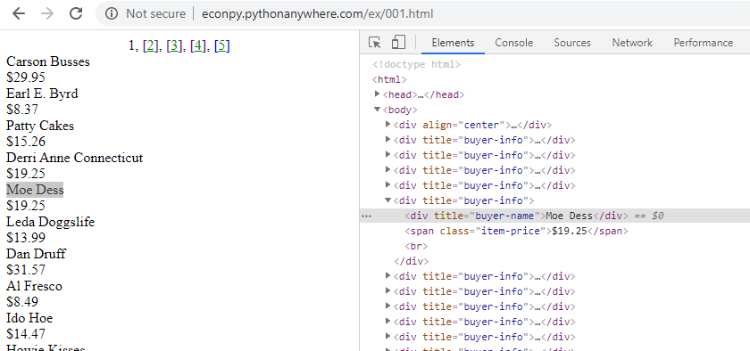

# Understanding website structure

Website content is usually represented using HTML, or **H**yper**t**ext **M**arkup **L**anguage. Web servers make this HTML content available to browsers using a data transfer protocol called HTTP (**H**yper**t**ext **T**ransfer **P**rotocol). Two of the most common HTTP request methods are *get* (to request data from a server) and *post* (to send data to a server). Web access documents in HTML format and display them in the browser window.

Web scraping tools use a website's HTML structure navigate the page and identify the content to scrape. Effective use of web scraping tools requires at least a basic understanding of how web pages are structured. Sites whose underlying structure is well organized and descriptive are usually easier to scrape.

<a href="https://developer.mozilla.org/en-US/docs/Learn/Getting_started_with_the_web/HTML_basics">Anatomy of an HTML element.</a>


## Using Browser "Inspect" tools

Modern browsers have built-in "inspect" tools that reveal the HTML structure of a web page. Right-click any part of a page and select *Inspect* or *Inspect element* to open a panel showing how the selected content is represented in the HTML.

In Safari and Microsoft Edge *inspect element* is not enabled by default. To enable:
**Safari** - Go to Preferences -> Advanced and enable *Show Developer menu in menu bar*
**Microsoft Edge** - press F12
{: .note}

This screenshot shows the *Inspect* tool applied to a website accessed with Chrome: http://econpy.pythonanywhere.com/ex/001.html   The website is a list of buyer names and item prices.



In a simple site it is easy to see the correlation between displayed content and HTML elements. You can expand the HTML elements in the inspection window to reveal other content, or hover over elements to highlight the corresponding section in the web page.

Web scrapers navigate the HTML structure using *XPath*, a language that identifies and selects content on the web site (referred to as nodes). In the example above all buyer names are contained in <div> elements like this

```
<div title="buyer-name">Moe Dess</div>
```

The XPath expression that identifies all "buyer-name" <div> elements on the page is

```
//div[@title="buyer-name"]
```


## Scraping examples

To help illustrate how scrapers use HTML to identify content we will use the Data Miner extension for Chrome.

- Scraping example 1: search results from [Google Scholar](https://scholar.google.com)
- Scraping example 2: Member of Parliament [addresses](https://www.ourcommons.ca/Members/en/search)

