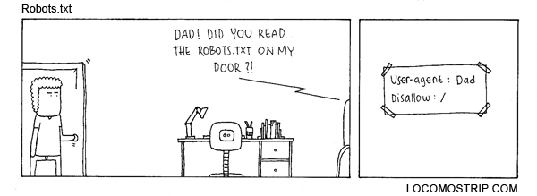

# What is web scraping?

Web scraping is a technique for extracting information from websites. This can be done manually
but it is usually faster, more efficient and less error-prone to **automate** the task.

Web scraping allows you to acquire non-tabular or poorly structured data from websites and convert it
into a usable structured format such as a .csv file or spreadsheet. In many cases scraping can save time by automating repetitive copy/paste retrieval processes.


Source: [https://xkcd.com/974/]

Specialized scraping tools can automate web data retrieval by defining what sites to visit, what information to look for, and whether data extraction should stop at the end of a page or continue to hyperlinked pages. Scraping processes can also be scheduled to run at regular intervals to capture changes in the data over time.

Online stores will often scour the publicly available pages of their competitors,
scrape item prices, and then use this information to adjust their own prices. Another common
practice is "contact scraping" in which email
addresses or phone numbers are collected for marketing purposes.

Web scraping is also increasingly used by scholars to create data sets for
text mining projects, such as collections of journal articles or digitised texts.


## Scraping vs crawling
It is helpful to differentiate between *web scraping* and *web crawling*.  Crawling is what search engines like Google do when mass-analysing the web to build their indices. A *crawler* is a type of bot that accesses pages and follows any links they find, "crawling" through an entire website or group of sites.

*Web scraping* is more targeted than crawling. A scraper identifies and extracts specific content from the pages it accesses. In practice crawlers and scrapers are sometimes used together but the examples in this workshop do not include crawlers.

Intensive scraping and crawling can put high demands on a website's server. Some sites disallow web scraping in their "terms of use" or specify how crawlers may access the site with a *robots.txt* file.


Source: [http://locomostrip.com/comic/179/]


## Is scraping the best option?

Scraping can automate repetitive data retrieval tasks but depending on the site there may be simpler ways to accomplish this. Choose the easiest tool for the job:

- Check whether or not you can easily copy and paste data from a site into Excel or Google Sheets. This might be quicker than scraping.
- Check whether the site provides an export feature with the data you need (e.g. for contact lists or search results).
- Check if the site or service provides an API to extract structured data. Depending on your comfort level with APIs this could be more efficient.


## Ethics and considerations

Just because something is online does not mean it is free to scrape. Sites may wish to control how the information they provide is accessed and used. A few questions to consider when deciding whether web scraping is appropriate:

- *Am I allowed to take this data?* Check the website for *terms of use* that affect web scraping.
- *Are there restrictions on what I can do with this data?* Making a local copy of publicly available data is usually OK, but there may be limits on use and redistribution of the content. Look for any *copyright* statements on the website.
- *Am I overloading the website's servers?* Scraping practice should respect the website's access rules, often encoded in *robots.txt* files.

There are grey areas as scraping involves interacting with a website in a way that the site owner might not have intended. When in doubt get in touch with a librarian or contact UBC's [Copyright Office](https://copyright.ubc.ca/support/contact-us/).

```python
from lxml import html
import requests
page = requests.get('http://econpy.pythonanywhere.com/ex/001.html')
tree = html.fromstring(page.content)
#This will create a list of buyers:
buyers = tree.xpath('//div[@title="buyer-name"]/text()')
#This will create a list of prices
prices = tree.xpath('//span[@class="item-price"]/text()')
print (buyers)
print (prices)
```
